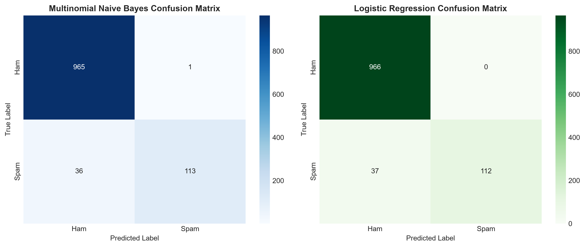

# SMS Spam Detection Model & Web Application Report
**Domain:** Artificial Intelligence & Machine Learning (AI/ML)  
**Task:** Spam Detection Classifier with Interactive Web Interface  

---

## 1. Project Description & Approach

### 1.1 Objective
Build a machine learning system that classifies SMS text messages as **Spam** or **Ham (Legitimate)**, and wrap it into an intuitive Streamlit web application where a user can type any message and receive an instant prediction.

### 1.2 Dataset Preprocessing
We used the **SMS Spam Collection Dataset** (5,572 total messages: 4,825 Ham, 747 Spam):
- **Lowercasing**: Converted all text to lowercase.
- **Noise Removal**: Removed URLs (`http/https/www`), punctuation, and special symbols using regular expressions.
- **Tokenization**: Tokenized text into clean word tokens.

### 1.3 Feature Extraction
- **TF-IDF Vectorizer**: Extracted numerical features using Term Frequency-Inverse Document Frequency (`max_features=5000`, `ngram_range=(1, 2)`, English stopwords removed).

### 1.4 Model Training & Comparison
We split the data into **80% Training** (4,457 samples) and **20% Testing** (1,115 samples) with stratification. Two models were trained and compared:
1. **Multinomial Naive Bayes (`MultinomialNB`)**
2. **Logistic Regression (`LogisticRegression`)**

---

## 2. Model Evaluation & Comparison

### 2.1 Performance Metrics Table

| Metric | Multinomial Naive Bayes (Selected) | Logistic Regression |
| :--- | :---: | :---: |
| **Accuracy** | **96.68%** | 96.68% |
| **Precision** | **99.12%** | 100.00% |
| **Recall** | **75.84%** | 75.17% |
| **F1 Score** | **85.93%** | 85.82% |

### 2.2 Model Selection Decision
- **Selected Model:** **Multinomial Naive Bayes**.
- **Reason:** It achieved a higher **Recall (75.84%)** and **F1 Score (85.93%)** compared to Logistic Regression (Recall: 75.17%, F1: 85.82%), effectively catching more spam messages while maintaining an exceptionally high precision of **99.12%**.

### 2.3 Confusion Matrices

---

## 3. Streamlit Web Application

The web application (`app.py`) provides:
- **Instant Message Classification**: Text area where users type/paste messages and see real-time Spam/Ham predictions.
- **Confidence Probabilities**: Visual progress bars showing Spam and Ham confidence percentages.
- **Trigger Word Indicators**: Identifies key words contributing to the classification.
- **Model Evaluation Dashboard**: Displays comparison metrics, tables, and confusion matrix plots.
- **Limitations & Improvements Overview**: Direct documentation of model boundaries and upgrade paths.

---

## 4. Model Limitations & How It Could Be Improved

### 4.1 Limitations:
1. **Short Messages**: Very short texts (*"ok"*, *"call me"*, *"yes"*) lack sufficient TF-IDF feature signals.
2. **Sarcasm & Semantic Context**: Bag-of-Words / TF-IDF models ignore sequence ordering and syntax, making subtle sarcasm difficult to detect.
3. **Unseen Slang & Typos**: Spammers using character substitutions (`c@sh`, `w1nner`, `fr33`) create out-of-vocabulary (OOV) tokens.
4. **Class Imbalance**: The dataset contains ~87% Ham vs ~13% Spam, requiring metrics like Recall and F1 to be closely monitored.

### 4.2 How It Could Be Improved:
1. **Transformer Encoders**: Fine-tuning pre-trained models like **BERT**, **DistilBERT**, or **RoBERTa** to capture sequence context and semantic meaning.
2. **Subword & Character Tokenization**: Using Byte-Pair Encoding (BPE) or character n-grams to handle obfuscated and misspelled words.
3. **Active Learning Feedback Loop**: Adding a reporting button in the app to collect edge cases and continually retrain the model.

---

## 5. Repository & Execution
- **Web App Launch:** `streamlit run app.py`
- **Training Script:** `python train_model.py`
- **Jupyter Notebook:** `spam_classifier.ipynb`
